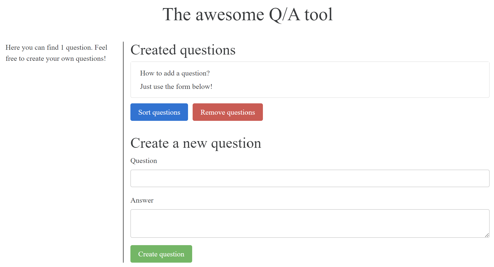

# Quality Assurance engineer test
This repo contains some simple test for simple web frontend app.

## App description
The app is Q&A generator.

It has 3 buttons with different functionality, 2 text inputs and < ul> < li> section


## Automated Testing Assignment
You can fork (and then clone your own version of) this repo and run:

```
$ python -m http.server 8000
```

For test was chosen set of technologies: `pytest` and `selenuim`. This is one of the most popular frameworks. 
The framework include simple `PageObject` and library for elements such as `button`, `input` and `list`. 
`PageObject` contains the most common use method for the page - add new question with an answer.

### Tests description
For run tests use 
```commandline
pytest tests
```
Test run include 3 test scenarios:

    1. Can we create a question
    2. Can we remove questions
    3. Can we sort questions

Every test open webdriver run scenario and close browser. It's done by pytest fixtures decorator.

More info about tests in docstrings in code part 


